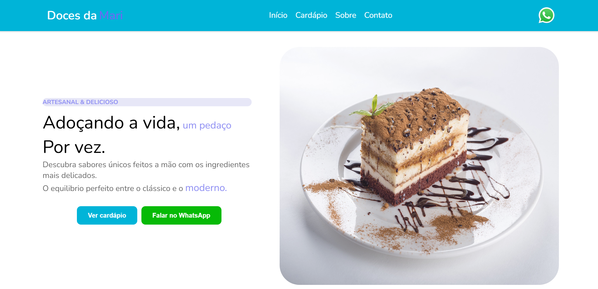

# 🍰 Doces da Mari

Landing Page desenvolvida para uma confeitaria fictícia, criada com o objetivo de apresentar uma marca, divulgar a empresa e facilitar o contato com os clientes.

## 📸 Preview



---

## 🚀 Tecnologias utilizadas

- React
- TypeScript
- CSS3
- Vite

---

## ✨ Funcionalidades

- ✅ Design responsivo
- ✅ Carrossel de produtos
- ✅ Seção de apresentação
- ✅ Cards de produtos
- ✅ Botões de contato
- ✅ Layout moderno

---

## 📂 Estrutura do projeto

```
src/
 ├── assets/
 ├── components/
 ├── pages/
 ├── App.tsx
 └── main.tsx
```

---

## ⚙️ Como executar o projeto

Clone o repositório

```bash
git clone https://github.com/eunathan098/Doces-Da-Mari-LP.git
```

Entre na pasta

```bash
cd Doces-Da-Mari-LP
```

Instale as dependências

```bash
npm install
```

Execute o projeto

```bash
npm run dev
```

---

## 🌐 Deploy

Acesse o projeto online:

**https://eunathan098.github.io/Doces-Da-Mari-LP/**

---

## 👨‍💻 Autor

Desenvolvido por **Nathan Cruz**.

- GitHub: https://github.com/eunathan098
